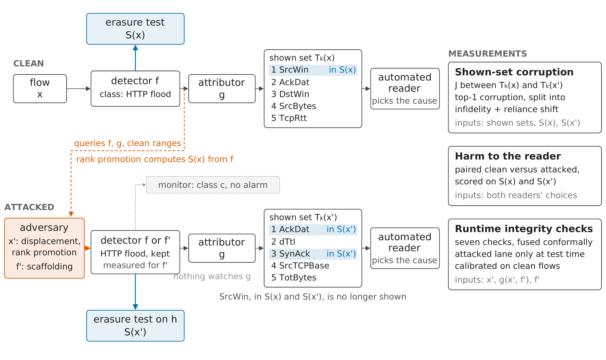

# Same Alert, Different Reason: Attribution Rewriting Attacks on Intrusion Detectors Explained to Machines

Code, experiments and results for the paper (I. Bibers and M. Abdallah, under review at IEEE
TIFS). The paper calls this benchmark the Explanation Integrity Benchmark (EIB); the source keeps
the code name XIntBench.

## What it does

**The benchmark and its ground truth.** A network intrusion detector raises an alert on a flow
and an attributor shows the top features behind it. EIB establishes, for each flow, which of
those features actually carry the detection: it erases each one toward its benign value and
records whether the detector's score falls. That erasure-causal set is the ground truth, fixed
per flow and per detector, with no human label anywhere.

**Three attacks on the shown explanation.** Cause displacement rewrites the flow within the
ranges its own extractor allows, so the detector keeps the alert while the shown features change.
Rank promotion pushes features that do not carry the detection into the shown list. Explainer
scaffolding replaces the deployed model with one that answers the explainer's probes from a
benign surrogate. All three leave the alert as it was, so nothing that watches predictions sees
them.

**Harm to an automated reader.** The consumer of the explanation is an open-weights language
model that reads the alert and the shown list and picks the feature to act on. It decides on the
clean and on the attacked explanation of the same flow, and each decision is scored against the
erasure-causal set, so the harm of an attack is a change in decisions, not a change in rankings.

**Seven runtime checks and their fusion.** Seven label-free checks run on the attacked lane
alone at test time: feature consistency, cross-method consensus, certified stability on all and
on free coordinates, two PASA variants and erasure faithfulness. Each is calibrated on clean flows
and they are fused by split conformal prediction at a nominal false-alarm level.



The clean lane (top) yields the shown set and the erasure-causal set of the flow; the attacked
lane (bottom) yields both for the rewritten flow or the scaffolded model; the three measurements
on the right are shown-set corruption, harm to the reader and the runtime integrity checks.

## Install

```bash
pip install -r requirements.lock.txt -c constraints.txt --extra-index-url https://download.pytorch.org/whl/cu124
make setup
```

Python 3.10. The lockfile pins the CUDA 12.4 build of torch 2.4.0, which lives on PyTorch's
own index; keep `-c constraints.txt` on every later install.

## Reproduce the tables

```bash
make floats
```

Every table in the paper is rebuilt from the committed artifacts under `results/` and comes out
byte-identical to the file the manuscript includes; `make verify` does the same in a fresh clone.
No dataset is needed.

## Run the experiments

Datasets are not redistributed. `scripts/download_data.py` fetches 5G-NIDD, CICIoT2023 and
CICIoMT2024 from their hosts under each one's academic-use terms.

```bash
python scripts/run_matrix.py                                                        # seeds 0-4
python scripts/run_decision_utility.py --seeds 0 1 2 3 4 --n-test 40 --judge Qwen/Qwen3-8B --judge microsoft/phi-4
python scripts/run_reference_decomposition.py --seeds 0 1 2 3 4                     # arms: --reference median, --tau 0.10, --scaffold-contamination 0.05 0.1 0.3
python scripts/run_c3_artifacts.py --seeds 0 1 2 3 4 --n-test 60 --stab-n 120 --stab-sigma 0.05
python scripts/run_generality.py --dataset <corpus> --seeds 0 1 2 3 4 --n-test 40 --stab-n 120 --stab-sigma 0.05
python scripts/run_transferability.py --seeds 0 1 2 3 4
python scripts/export_motivating_examples.py                                        # seed 0, 5G-NIDD
python scripts/report_detector_accuracy.py                                          # seeds 0-4
```

The decision task needs a GPU and the two judges; everything else runs on CPU.

## Repository layout

```
configs/      dataset definitions and the default experiment configuration
docs/         the benchmark description (XINTBENCH.md) and the overview figure
figures/out/  the paper's figures as PDFs
results/      one directory per run, each with meta/ (commit, configuration, wall clock), raw/ and summary/
scripts/      the run, audit and export scripts
src/avert/    the package: data, detectors, attribution, benchmark, signals, fusion, eval
tables/       the table generator (src/) and the generated tables (out/)
tests/        the test suite
```

```
results/
  _cache/                          the cases shown to the judges in the decision task
  _logs/                           data audits, feature identities, judge prompt revisions, regime grid, signal-1 summary, split-leakage check
  MANIFEST.csv                     every float in the paper and the run behind it
  c3_artifacts_<corpus>/           per-flow check scores, conformal calibration, certified radii and ablations
  decision_utility/                every decision of both judges on clean and attacked explanations, plus the shuffled control
  detector_accuracy/               test accuracy of the tree detector in each matrix cell
  generality_mlp_ig_<corpus>/      the same checks on the MLP + integrated-gradients pipeline
  matrix/                          the detectability map over corpora, attacks, classes and seeds
  motivating_examples/             the three flows of the motivating figure
  reference_decomposition/         the reader scored against the erasure-causal set of the shown flow, and the corruption decomposition
  reference_decomposition_a3_c005/ scaffold contamination 0.05
  reference_decomposition_a3_c01/  scaffold contamination 0.1
  reference_decomposition_a3_c03/  scaffold contamination 0.3
  reference_decomposition_median/  median instead of mean as the erasure reference
  reference_decomposition_tau010/  causal threshold 0.10 instead of 0.05
  split_leakage/                   can a classifier tell training flows from test flows under the grouped split
  transferability/                 the displacement attack crafted on a surrogate and scored on the deployed detector
```

## Citation

The paper is under review; cite it as in `CITATION.cff`, which also carries the software entry.

MIT license.
