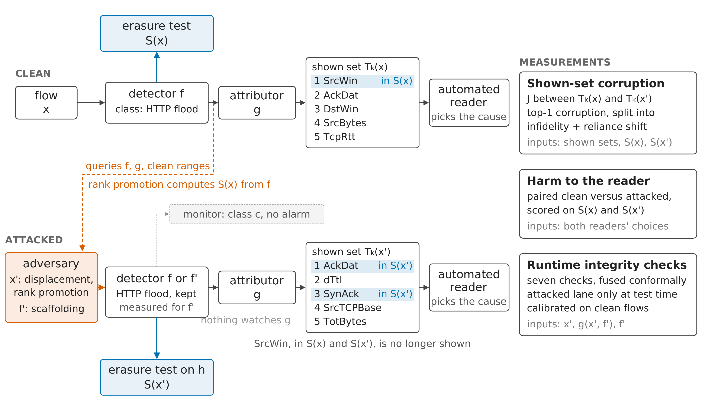

# Same Alert, Different Reason: Attribution Rewriting Attacks on Intrusion Detectors Explained to Machines

Code, experiments and results for the paper (I. Bibers and M. Abdallah, under review at IEEE
TIFS). The paper calls this benchmark the Explanation Integrity Benchmark (EIB); the source keeps
the code name XIntBench.

## What it does

**The benchmark and its ground truth.** A network intrusion detector raises an alert on a flow
and an attributor shows the top features behind it. EIB establishes, for each flow, which of
those features actually carry the detection: it erases each one toward its benign value and
records whether the detector's score falls. That erasure-causal set is the ground truth, fixed
per flow and per detector, with no human label anywhere.

**Three attacks on the shown explanation.** Cause displacement rewrites the flow within the
ranges its own extractor allows, so the detector keeps the alert while the shown features change.
Rank promotion pushes features that do not carry the detection into the shown list. Explainer
scaffolding replaces the deployed model with one that answers the explainer's probes from a
benign surrogate. All three leave the alert as it was, so nothing that watches predictions sees
them.

**Harm to an automated reader.** The consumer of the explanation is an open-weights language
model that reads the alert and the shown list and picks the feature to act on. It decides on the
clean and on the attacked explanation of the same flow, and each decision is scored against the
erasure-causal set, so the harm of an attack is a change in decisions, not a change in rankings.

**Seven runtime checks and their fusion.** Seven label-free checks run on the attacked lane
alone at test time: feature consistency, cross-method consensus, certified stability on all and
on free coordinates, two PASA variants and erasure faithfulness. Each is calibrated on clean flows
and they are fused by split conformal prediction at a nominal false-alarm level.



The clean lane (top) yields the shown set and the erasure-causal set of the flow; the attacked
lane (bottom) yields both for the rewritten flow or the scaffolded model; the three measurements
on the right are shown-set corruption, harm to the reader and the runtime integrity checks.

## Install

```bash
pip install -r requirements.lock.txt -c constraints.txt --extra-index-url https://download.pytorch.org/whl/cu124
make setup
```

Python 3.10. The lockfile pins the CUDA 12.4 build of torch 2.4.0, which lives on PyTorch's
own index; keep `-c constraints.txt` on every later install.

## Reproduce the tables

```bash
make floats
```

Every table in the paper is rebuilt from the committed artifacts under `results/` and comes out
byte-identical to the file the manuscript includes; `make verify` does the same in a fresh clone.
No dataset is needed.

## Run the experiments

Datasets are not redistributed. `scripts/download_data.py` fetches 5G-NIDD, CICIoT2023 and
CICIoMT2024 from their hosts under each one's academic-use terms.

```bash
python scripts/run_matrix.py                                                        # seeds 0-4
python scripts/run_decision_utility.py --seeds 0 1 2 3 4 --n-test 40 --judge Qwen/Qwen3-8B --judge microsoft/phi-4
python scripts/run_reference_decomposition.py --seeds 0 1 2 3 4                     # arms: --reference median, --tau 0.10, --scaffold-contamination 0.05 0.1 0.3
python scripts/run_c3_artifacts.py --seeds 0 1 2 3 4 --n-test 60 --stab-n 120 --stab-sigma 0.05
python scripts/run_generality.py --dataset <corpus> --seeds 0 1 2 3 4 --n-test 40 --stab-n 120 --stab-sigma 0.05
python scripts/run_transferability.py --seeds 0 1 2 3 4              # separate run: one class per corpus, 20,000 training rows, 100x3 draws
python scripts/export_motivating_examples.py                                        # seed 0, 5G-NIDD
python scripts/report_detector_accuracy.py                                          # seeds 0-4
python scripts/run_matrix.py --out results/matrix_a3_survivors --name matrix_a3_survivors --per-flow
python scripts/report_scaffolding_survivors.py                                      # needs the run above
python scripts/report_split_sample_harm.py                                          # re-scores cached decisions, no GPU
python scripts/export_attacked_flows.py                                             # writes the attacked flows
python scripts/export_model_artifacts.py                                            # regenerates artifacts/models/ (weights not shipped; check against manifest.json)
python scripts/run_reference_decomposition.py --first-valid-draw --attacks A1_displacement --decomposition-only --out results/baseline_random_draw --name baseline_random_draw
python scripts/export_baseline_cases.py                                             # reader cases for the random-draw arm
python scripts/run_decision_utility.py --cases results/baseline_random_draw/raw/cases.json --name decision_utility_baseline --conditions clean attacked --shuffle-n 0 --sensitivity-n 0
python scripts/report_baseline_reader_harm.py                                       # attack, random draw and their difference, no GPU
python scripts/run_certified_scale.py --datasets <corpus>                           # then --summarize; noise in sigma_train units
python scripts/run_scaffold_permutation.py --datasets <corpus>                      # then --summarize; permutation attributor shown
python scripts/run_decision_utility.py --cases results/scaffolding_permutation/raw/cases.json --name decision_utility_scaffold_perm --conditions clean attacked --preserved-only --shuffle-n 0 --sensitivity-n 0
python scripts/report_scaffold_perm_harm.py                                         # no GPU
python scripts/report_rebuild_bound.py                                              # S(x) recomputed at rescoring, no GPU
```

The decision task needs a GPU and the two readers. The `report_*.py` scripts read saved
artifacts and need neither a GPU nor the corpora.
Everything else on this list needs the corpora downloaded, unlike `make floats`.

## Repository layout

```
artifacts/    All code, attacked flows and per-seed results are released, with a manifest that verifies models
              regenerated from the corpora: models/manifest.json carries one entry per detector and scaffold
              artifact, recording its feature order, class mapping, training rows, held-out accuracy and sha256.
              The weight files themselves are not committed -- they are derived from corpora distributed under
              academic-use terms, and they are large. `python scripts/export_model_artifacts.py` regenerates all
              of them from the corpora; compare the sha256 you get against the manifest.
configs/      one file per corpus: its loader settings, the columns dropped and the audit that justified them
docs/         the benchmark description (XINTBENCH.md) and the overview figure
figures/out/  the paper's figures as PDFs
results/      one directory per run, each with meta/ (commit, configuration, wall clock), raw/ and summary/
scripts/      the run, audit and export scripts
src/avert/    the package: data, detectors, attribution, benchmark, signals, fusion, eval
tables/       the table generator (src/) and the generated tables (out/)
tests/        the test suite
```

```
results/
  _cache/                          the cases shown to the judges in the decision task
  _logs/                           data audits, feature identities, judge prompt revisions, regime grid, signal-1 summary, split-leakage check
  c3_artifacts_<corpus>/           per-flow check scores, conformal calibration, certified radii and ablations
  decision_utility/                every decision of both judges on clean and attacked explanations, plus the shuffled control
  detector_accuracy/               test accuracy of the tree detector in each matrix cell
  generality_mlp_ig_<corpus>/      certified stability on the MLP + integrated-gradients pipeline
  matrix/                          the detectability map over corpora, attacks, classes and seeds
  matrix_a3_survivors/             the same map re-run with every check's score kept per flow, so detectability can be
                                   restricted to the flows whose predicted class the scaffold's router did not flip
  scaffolding_survivors/           those restricted rows, beside the all-flow rows, with the check that the all-flow
                                   arm reproduces matrix/raw.json exactly
  split_sample_harm/               reader harm with competence read off one half of each cell's flows and the effect
                                   measured on the other
  attacked_flows_export/           run metadata for the attacked-flow export; the flows themselves are in
                                   reference_decomposition/raw/attacked_flows.json
  motivating_examples/             the three flows of the motivating figure
  reference_decomposition/         the reader scored against the erasure-causal set of the shown flow, the corruption
                                   decomposition, the Holm criterion (summary/holm.json), and raw/attacked_flows.json:
                                   the attacked feature vector behind every rescored instance
  reference_decomposition_a3_c005/ scaffold contamination 0.05
  reference_decomposition_a3_c01/  scaffold contamination 0.1
  reference_decomposition_a3_c03/  scaffold contamination 0.3
  reference_decomposition_median/  median instead of mean as the erasure reference
  reference_decomposition_tau010/  causal threshold 0.10 instead of 0.05
  split_leakage/                   can a classifier tell training flows from test flows under the grouped split
  transferability/                 a separate, smaller run: cause displacement crafted against a surrogate of the same
                                   family at another training seed and handed to the deployed detector. One class per
                                   corpus, detectors trained on 20,000 rows, 40 flows per corpus and seed, attack budget
                                   100 draws x 3 restarts. Not the headline setting.
```

## Citation

The paper is under review; cite it as in `CITATION.cff`, which also carries the software entry.

MIT license.
